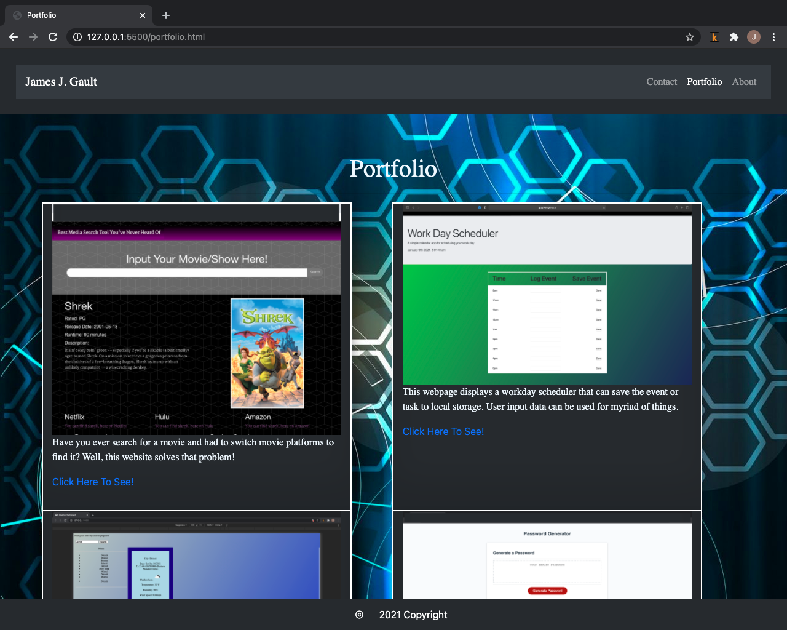

# Portfolio

---

## Description

This webpage displays a few projects that were developed to display different elements of web development.

---

## Preview

[LiveLink] (https://jjg1488.github.io/portfolio/)

--

## Developers

James J. Gault

---

## Technologies

1. HTML
2. CSS
3. Bootstrap

---

## Foresight

This website is based upon having a mobile-first, responsive design. As standards change, this webpage will continue to reflect the proper implementation of mobile-first, responsive design.

---

## Incentive

Driven by the need to display proper mobile-first, responsive design that will allow any and everyone to navigate this page and any future web pages with content that renders properly across different devices and screen sizes.

---

## Challenges

Building a responsive layout using a frameworks' grid system can be challenging. The main challenge can be trying to get the browser to display content exactly where you want it to show. Going through the documentation helps and great deal.

---

## Reasoning

This project was built as a means to show competence in responsive layout design and mobile-first application development.

---

## Solution

If websites are not up to date with responsive web design, a second website may be needed in order to have to content render on different devices properly. Having a responsive mobile-first application will help to save on extra costs when it comes to development with just this alone. Responsive web applications help end users to use the web page more effectively with their desired screen size and device.

---

## Take away

Mobile-first, responsive web design is important. There is nothing more unattractive to an end user than to see a poorly displayed web page that has their interest. Along side of having an eye sore, poorly built websites that do not render properly on different devices can bring about suspicion of brand authenticity and push a potential client or reader of your content away.

---